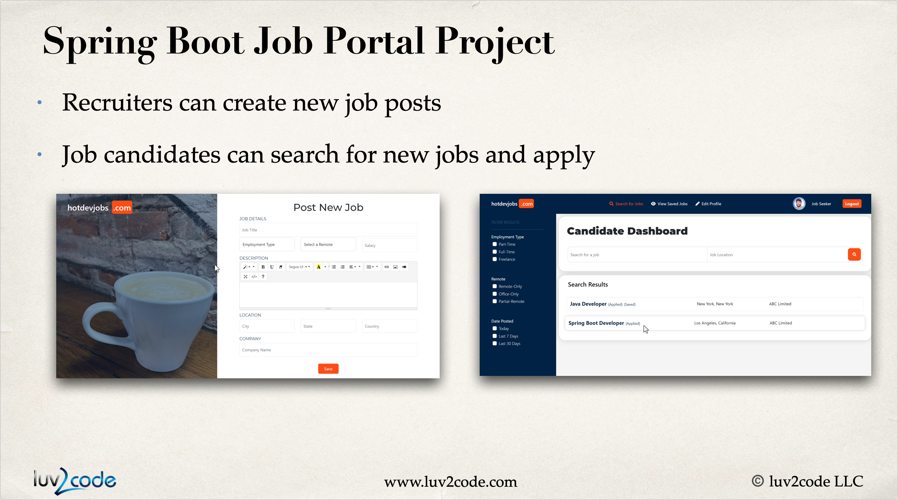

## 🌐 Job Portal Web Application — Spring Boot 3 Project

This is a Job Portal Web Application built using Spring Boot 3, Spring Data JPA, Hibernate, MySQL, and Thymeleaf.
It allows users to register, post jobs, apply for jobs, and manage applications in an intuitive and secure environment.

## 🧩 Tech Stack

| Layer    | Technology                      |
| -------- | ------------------------------- |
| Backend  | Java 17, Spring Boot 3          |
| Frontend | Thymeleaf, HTML, CSS, Bootstrap |
| Database | MySQL                           |
| ORM      | Hibernate, Spring Data JPA      |
| Security | Spring Security 6               |
| Tools    | Maven, Spring DevTools          |

## ⚙️ Setup Instructions

1. Clone the repository

    git clone https://github.com/prakashraj-kp/job-portal.git
    cd job-portal

2. Configure the MySQL database in application.properties:

    spring.datasource.url=jdbc:mysql://localhost:3306/job_portal
    spring.datasource.username=root
    spring.datasource.password=yourpassword
  spring.jpa.hibernate.ddl-auto=update
     
3. Run the application

     mvn spring-boot:run

4. Open in browser

    http://localhost:8080

### 🧑‍💻 Author

**Prakash Raj**  
📧 **Email:** prakashraj2020.pk@gmail.com  
🌐 **GitHub:** [github.com/prakashraj123](https://github.com/prakashraj-kp)

